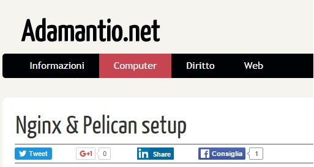
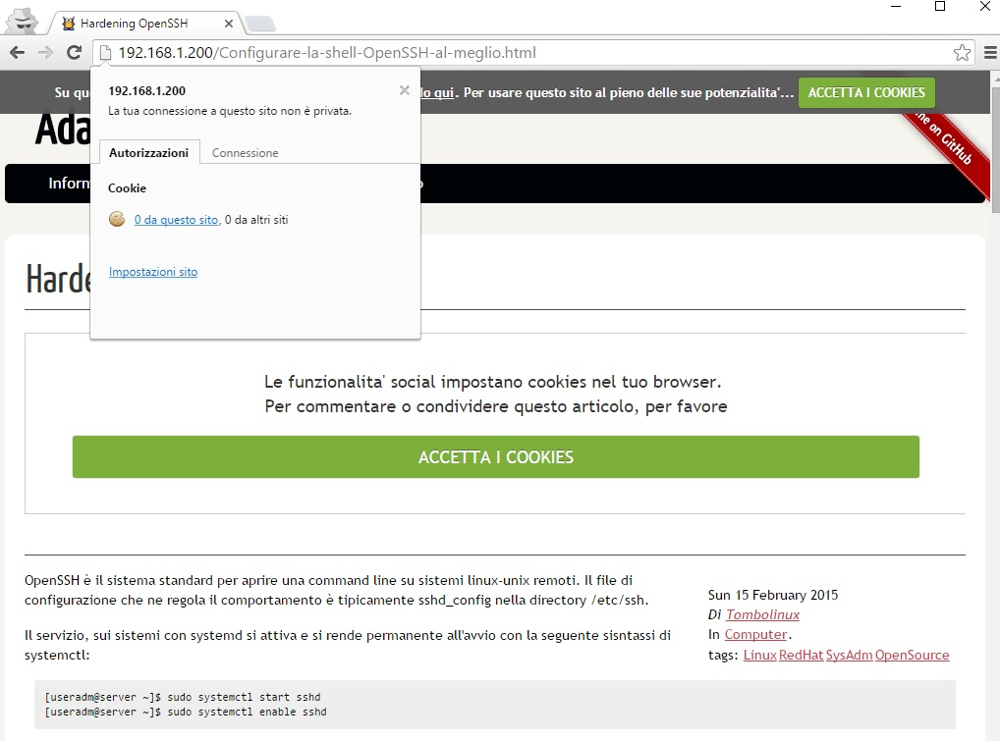

# adamantio-theme #

Il tema adamantio.net è derivato dal tema notmyidea distribuito con Pelican ed adattato nello stile, nelle prestazione ed alle esigenze legali Europee.

v.0.0 Localizzzazione in italiano

v.0.1 Ritocco di traduzione

v.0.2 Ritocco fogli di stile

v.0.3 Aggiunta social buttons

## Screenshot 1 ##

v.0.4 Spostamento google-verification code method TAG from footer to header

v.0.5 Https compliance
	  Risolto il caricamento di oggetti http/https nella medesima pagina

v.0.6 Importate google fonts e css
	  Gli oggetti di google sono ora componenti statiche del tema 

v.0.7 Migliorie prestazionali: 
      compressione, unificazione e minimizzazione CSS
      aggiunta header per miglior fruizione sui dispositivi mobili
	  
v.0.8 Revisione delle componenti del tema per una migliore resa visiva del codice html.
	  Integrazione del framework javascript jquery.
	  Adeguamento alla cookie law, direttiva 2009/136/CE - recepita in italia con 
	  provvedimento del Garante per la protezione dei dati personali dell'8 maggio 2014.

## Screenshot 2 ##

## Installazione: ##

user@site:~$ sudo pelican-themes -U /path/to/adamantio-theme/notmyidea-it